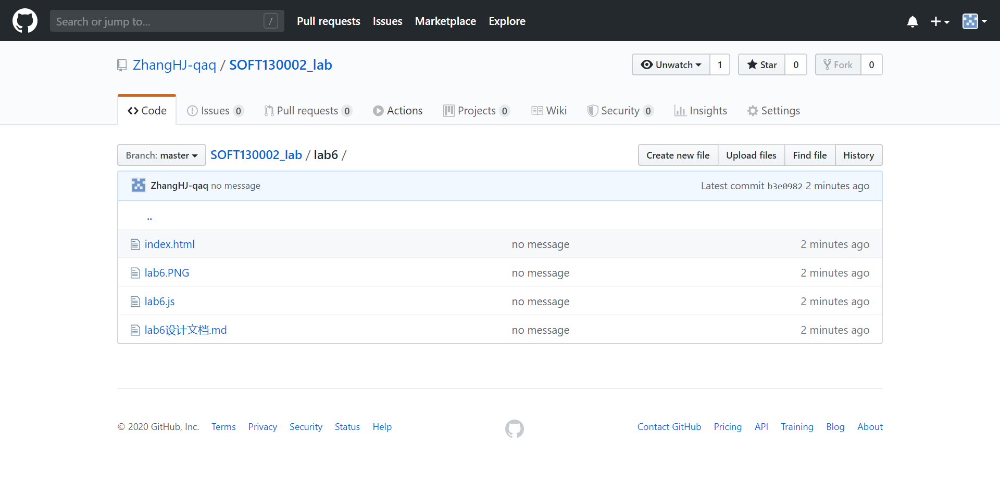
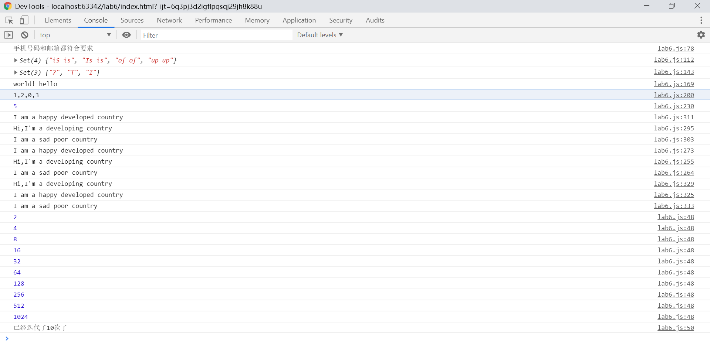

# Lab6设计文档

## 各个正则表达式的理解

### 第二题（测试邮箱）

```
let mailPattern = /^[0-9a-zA-Z][0-9a-zA-Z\-.]+@([a-zA-Z0-9]+\.)+[a-z]{2,4}$/;
```

邮箱可以分成@号前面和后面的部分

**[0-9a-zA-Z]** 第一个字符必须为字母或数字

**[0-9a-zA-Z\-.]+** @号前面的剩余部分由字母，数字，下划线，小数点和横杠组成

- **([a-zA-Z0-9]+\.)+[a-z]{2,4}** 匹配@号后面的部分。其中顶级域名的只能是字母，且长度应该在2至4之间。

### 第三题（test Redundancy）

```
let pattern = /\b([a-zA-Z]+)( \b\1\b)+/gi;
```

匹配两个或多个多个重复的英语单词。 如“apple Apple aPPle" 其中\1匹配前面括号内子表达式匹配到的实际文本，g表示全局搜索，i表示不区分大小写。


## 继承不同方式的理解

- 借用构造函数：在子类型的构造函数中用.call()调用超类型中的构造函数。优点是可以向超类型的构造函数中传递参数，缺点是很难做到多个同一类型的实例的方法共用，在超类型原型中定义的方法在子类型的实例中也不可见。

- 原型链：将子类型的原型设置成超类型的实例。可以实现方法共用，但会导致子类型继承得到的属性由各个实例共享（挂在原型上）

- Object.create()：传入第一个参数可以使返回的对象具有指定的原型。

  

## Map、Set、Array之间的区别和使用

Set是无重复项的集合

Map是键与相对应值的映射。键可以是包括字符串在内的任何数据类型

Array是从0开始的数于相应值的映射。







